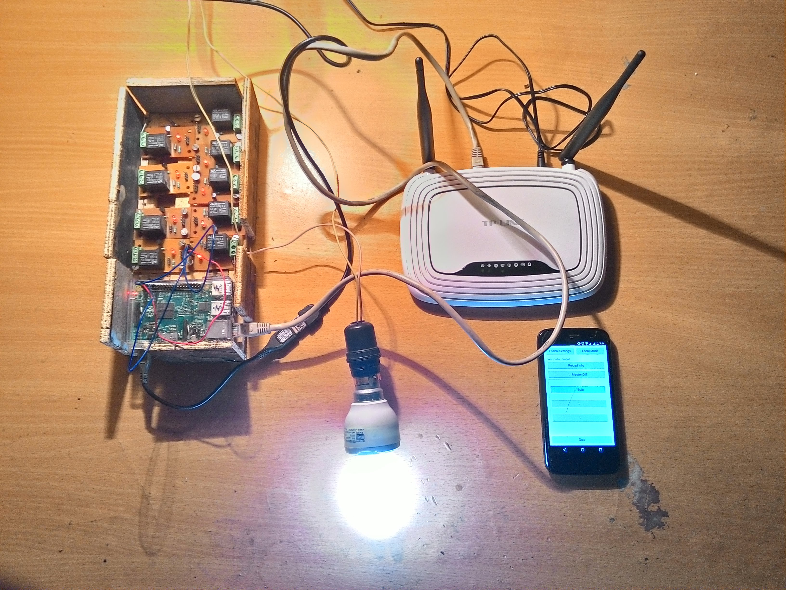

# SmartSwitch Client App

## Overview
SmartSwitch Client App is an Android application created as a part of Home Automation Project.

This application allows user to connect to a micro-controller (Arduino / Raspberry Pi) either through
local network or Internet and switch on or off electrical appliances connected to the controller.
It provides a simple to use graphical interface to set number of switches to control and name them and
micro-controller to connect to.

Some part of code has been modified in order to hide identifiable information (like IP address, MAC address
and Web address).

## Installation

#### Build requirements
Qt framework (version 4)
Qt C++ cross compilers for Android
Open JDK
Android SDK.

## LICENSE
SmartSwitch Client App is licensed under the GPL v2. See file LICENSE for more information.

## Copyright
All Copyrights are owned by their respective owners.
